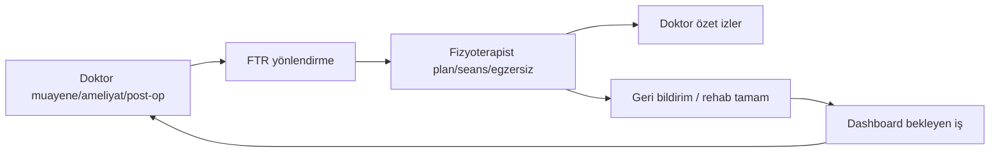

# DrMem Clinic — Product IA Decision Sweep v1

> **Belge türü:** Ürün / navigasyon / klinik akış karar paketi (planlama only)  
> **Kod / migration / test:** Yok — uygulama için §14 Cursor promptu  
> **Önkoşul:** [staging_trial_result_report_v1.md](../staging_trial_result_report_v1.md) — Conditional Go / Practical Pass  
> **Üretim:** 2026-05-28

---

## 1. Genel ürün kararı özeti

| Karar ekseni | Öneri (v1 yönü) |
|--------------|------------------|
| Ürün dili | **“Workbench” UI’dan kalkar**; kod içi `DashboardWorkbench*` kalabilir |
| Ana ekran | Rol bazlı doğal başlık: **Bugün** (doktor), **Operasyon** (asistan), **Fizyoterapi** (FTR), **Stok** (hemşire) |
| Sidebar üst | **Klinik adı birincil** (zaten `AppShell` + tenant); logo **v2** (ayarlar paketi) |
| Sidebar IA | **“Klinik” grup başlığı kalkar**; çekirdek modüller düz liste; FTR doktorda **sadeleşir** |
| Doktor–FTR | v1: yönlendirme + özet; v2: geri dönüş + grafik + tam iş kuyruğu |
| Dashboard işler | v1: **türetilmiş “Bekleyenler” paneli** (push notification değil) |
| Randevu→muayene | v1: **Muayene Başlat** + `appointmentId` + status `geldi` / tamamlanınca uyum |
| PDF | v1: **bağlamsal kısayollar** (hasta/randevu/muayene); ana menüde kalır ama ikincil |
| Chip yoğunluğu | Liste: marker öncelikli; hasta bağlamında **satır modeli ayrışır** |
| Ödeme KPI | **P2** — `PaymentSummaryKpiStrip` yeterli; yoğunluk şikâyeti devam ederse ince ayar |

**P0:** Yok (trial ile uyumlu).

**P1 (ürün):** Muayene veri girişi ergonomisi + randevu→muayene handoff + sidebar/ başlık netliği.

**P2:** FTR geri yönlendirme workflow, klinik logo upload, gelişim grafikleri, tam notification altyapısı.

---

## 2. Ana ekran başlık önerisi

### Mevcut durum (kod)

| Rol | `PageHeader` başlığı |
|-----|----------------------|
| Doktor | `Klinik Workbench` |
| Asistan | `Operasyon Workbench` |
| Fizyoterapist | `Fizyoterapi Workbench` |
| Hemşire | `Hemşire Workbench` |

İç mimari: `DashboardWorkbenchDataSource`, `DashboardWorkbenchSection` — **değiştirilmez** (bu pakette).

### Karar

| Katman | Karar |
|--------|--------|
| **Kullanıcı UI** | “Workbench” **kullanılmaz** |
| **Doktor `PageHeader.title`** | **`Bugün`** |
| **Asistan** | **`Operasyon`** veya **`Günlük Akış`** → öneri: **`Operasyon`** (mevcut operasyonel rol ile uyumlu) |
| **Fizyoterapist** | **`Fizyoterapi`** |
| **Hemşire** | **`Stok & Sarf`** veya **`Bugün`** → öneri: **`Stok & Sarf`** (tek odak) |
| **Alt başlık / bağlam** | Tenant klinik adı (`ActiveTenantContext` / ayarlar) — sidebar ile tekrar etmemek için dashboard’da **kısa specialty veya tarih** |
| **Ürün markası** | “DrMem Clinic” yalnızca login / hakkında; dashboard başlığı **değil** |
| **Kişisel klinik adı** | “Dr. Mehmet Yalçınozan Kliniği” yalnızca **tenant `name`** olarak sidebar üstünde; PageHeader’da **değil** (uzun) |

**Reddedilen adaylar ve neden:**

| Aday | Neden red |
|------|-----------|
| Klinik Workbench | İngilizce teknik; staging geri bildirimi negatif |
| Klinik Akış / Günlük Akış | Doktor için “Bugün” daha operasyonel |
| DrMem Clinic | Marka, günlük iş yüzeyi değil |

---

## 3. Sidebar / branding önerisi

### Mevcut durum

- `AppShell`: tenant / ayarlardan **`clinicName` + specialty** sidebar üstte gösteriliyor.
- Uygulama ikonu: Material `Icons` nav öğelerinde; **klinik logosu yok**.
- Doktor sidebar: 4 grup — `Klinik`, `Fizyoterapi & Egzersiz`, `Operasyon`, `Sistem`.

### Karar — sidebar üst kimlik

| Soru | Karar |
|------|--------|
| Klinik adı mı? | **Evet — birincil** (mevcut davranış korunur, tipografi iyileştirilir) |
| Logo mu? | **v2** — `Clinic Branding Settings v1` (upload + storage ayrı paket) |
| Uygulama vs klinik logosu | **Klinik logosu** (tenant); DrMem markası login’de |
| Icon yerine logo | v1: **yalnızca metin**; v2: 32–40px logo + kısaltılmış ad (dar sidebar’da monogram) |
| Settings | `clinicName` local prefs + Supabase tenant name **senkron stratejisi** ayrı netleştirilir (mevcut risk dokümante) |

### Karar — sidebar IA (doktor)

**“Klinik” section title → kaldır.** Çekirdek modüller **düz blok** (görsel ayırıcı ile):

| Sıra | Menü etiketi (öneri) | Route | Not |
|------|----------------------|-------|-----|
| 1 | Hastalar | `/patients` | |
| 2 | Randevular | `/appointments` | |
| 3 | Muayene | `/clinical-records` | “Muayene Kayıtları” → kısalt |
| 4 | Ameliyat / İşlem | `/surgery-notes` | |
| 5 | Post-op Takip | `/post-op-protocols` | |
| — | *ince ayırıcı* | | |
| 6 | FTR Yönlendirme | `/physiotherapy/referrals` | **Tek FTR girişi doktorda** |
| — | *ince ayırıcı* | | |
| 7 | Dosyalar | `/files` | PDF’ye köprü |
| 8 | Ödemeler | `/payments` | |
| 9 | Onam | `/consents` | |
| — | *ince ayırıcı* | | |
| 10 | Stok | `/inventory` | |
| 11 | PDF Çıktıları | `/pdf-outputs` | ikincil; bağlam kısayolları birincil olacak |
| 12 | Audit | `/audit-logs` | |
| 13 | Ayarlar | `/settings` | |

**Doktor sidebar’dan kaldır (FTR detay):**

- `Fizyoterapi Seansları` → yalnız fizyoterapist
- `Egzersiz Programları` → yalnız fizyoterapist (doktor hasta detayından yönlendirme yapabilir)

### Karar — fizyoterapist sidebar

Mevcut `Fizyoterapi` grubu korunur; etiketler sadeleştirilir:

| Etiket | Route |
|--------|-------|
| Klinik Özetler | `/physiotherapy/clinical-summaries` |
| Yönlendirmeler | `/physiotherapy/referrals` |
| Seanslar | `/physiotherapy/sessions` |
| Egzersiz | `/exercise-plans` |
| Post-op | `/post-op-protocols` |

### Karar — asistan sidebar

`Operasyon` grubu → başlık **kaldır** veya “Günlük” olarak kısalt; öğeler: Hastalar, Randevular, Tanı Özeti, Dosyalar, Ödemeler, Onam (role gate ile).

---

## 4. Doktor / FTR IA kararı

### Hedef akış (ürün vizyonu)



### v1 (yapılmalı)

| Öğe | Kapsam |
|-----|--------|
| Doktor sidebar FTR sadeleştirme | Yalnız yönlendirme listesi + hasta/muayene detayından “FTR’ye yönlendir” |
| Doktor FTR özet | Mevcut **safe summary** + hasta detay “son muayene” kartı; **yeni grafik yok** |
| Fizyoterapist operasyon | Seans / egzersiz / planlama **FTR ekranında tam** |
| Randevu | Asistan veya FTR randevu modülünden (mevcut) |
| Geri yönlendirme | **v2** — status alanı + dashboard iş kuyruğu |

### v2 (ertelenmeli)

- Rehab tamamlandı → doktora otomatik iş öğesi + bildirim
- Gelişim grafikleri
- Push / e-posta notification
- Çok adımlı referral state machine (DB)

### Doktor ekranında FTR özet nerede?

| Yüzey | İçerik |
|-------|--------|
| Hasta detay | Son FTR yönlendirme durumu + link |
| FTR yönlendirme detay | Safe summary (mevcut) |
| Muayene detay | “FTR yönlendirildi” marker + kısayol (chip değil, tek satır metin) |
| Dashboard v1 | “Açık FTR yönlendirmeleri” sayısı (derived) |

---

## 5. Dashboard notification / work item kararı

### Karar: **Evet — v1’de derived panel**

| Boyut | Karar |
|-------|--------|
| Tür | **Türetilmiş iş listesi** (mock + staging query); gerçek zamanlı push **değil** |
| Konum | Dashboard’da KPI strip altında **“Bekleyenler”** (max 5–7 öğe) |
| İlk kaynaklar (v1) | Bugünkü randevular; `planlandi` yaklaşan; onam `bekliyor` (mock); ödeme `bekliyor` (mock); açık FTR yönlendirme (mock sayım) |
| v1 dışı | FTR geri dönüş; rehab tamamlandı; stok kritik (hemşire dashboard’da) |
| Rol | Doktor + asistan; FTR/hemşire **kendi** iş listesi (v2) |

**Neden derived?** Notification altyapısı (DB, okundu, push) P2; operatör değeri hızlı kazanım.

---

## 6. Appointment → Clinical handoff kararı

### Karar: **Evet — ayrı paket**

**Paket adı:** `Appointment → Clinical Encounter Handoff v1`

| Soru | Karar |
|------|--------|
| Randevu detayda “Muayene Başlat”? | **Evet** — `planlandi` ve `ertelendi` için; `iptal`/`gelmedi` için hayır |
| Query params | `/clinical-records/new?patientId={id}&appointmentId={id}` |
| Form | `appointmentId` optional alan; kayıtta bağla |
| Status güncelleme | **Muayene formu açılınca:** `planlandi` → **`geldi`** |
| **Muayene tamamlandı kayıt:** | `geldi` kalır veya iş kuralı: encounter `tamamlandi` → randevu **otomatik kapanmaz** (aynı gün birden fazla işlem); yalnızca “muayene oluşturuldu” flag metadata — **v1 basit:** sadece `geldi` |
| Enum | Mevcut: `planlandi, geldi, gelmedi, iptal, ertelendi` — **yeni enum yok** |
| Repository | Supabase appointment `update` — küçük scope, RLS mevcut doctor/assistant |

**Kapsam dışı handoff v1:** Otomatik encounter draft, çift muayene engeli (v1.1).

---

## 7. Contextual PDF actions kararı

### Mevcut

- Sidebar: `/pdf-outputs` (doktor)
- Hasta detay: PDF listesi + “PDF hazırla” (`source=clinical_encounter&id=`)

### Karar

| Yüzey | v1 aksiyon |
|-------|------------|
| Hasta detay | **Koru** + iyileştirilmiş etiket |
| Muayene detay | **Ekle:** “PDF oluştur” → `/pdf-outputs/new?patientId&source=clinical_encounter&id=` |
| Randevu detay | **Ekle:** “PDF oluştur” (hasta bağlamı) |
| Dosyalar | Mevcut |
| Dashboard | **Kalsın** ama menüde **altta**; birincil erişim bağlamdan |

**Paket adı:** `Contextual PDF Actions v1`  
**Storage/RLS:** Değişmez; yalnız route + `DetailActionsPanel` / launcher.

**Not:** PDF listesi hâlâ mock repo ise listede boş — ayrı “PDF List Remote v1” backlog.

---

## 8. Status chip minimalism kararı

### Mevcut kural (`ClinicalListStatusTones`)

- Randevu chip: yalnız `gelmedi`, `iptal`, `ertelendi`
- Muayene chip: `taslak`, `kontrolPlanlandi`, `ameliyatPlanlandi`
- Diğer: marker renk + legend

### Karar (sıkılaştırma)

| Bağlam | Chip | Marker |
|--------|------|--------|
| Global liste | Mevcut kural | Her zaman |
| Hasta detay alt listeler | **Chip kapalı** (yalnız marker + kısa metin) | Evet |
| Detay ekran üst | **Durum tek satır metin**; chip yok | — |
| “Kontrol planlandı” | Listede chip **kalabilir**; hasta detayda **metin** | |

**Paket:** `Clinical List Status Minimalism v1.1` veya `Patient Detail Clinical Rows Polish v1` ile birleştirilebilir.

---

## 9. Hasta detay clinical rows kararı

### Sorun

`ClinicalEncounterClinicalListRow` hasta detayında da kullanılıyorsa **hasta adı + demografi tekrar** eder.

### Karar — `PatientScopedClinicalEncounterRow` (yeni widget, UI only)

| Alan | Hasta detay satırı | Global muayene listesi |
|------|--------------------|-------------------------|
| Başlık | Ziyaret tipi + bölge/taraf | Hasta adı |
| Alt satır | Ön tanı / kesin tanı kısa | Demografi + dosya no |
| 2. satır | Tarih + durum metni | Tanı özeti |
| Chip | Hayır | Kurala göre |
| Hasta adı | **Hayır** | Evet |

**Paket adı:** `Patient Detail Clinical Rows Polish v1`

---

## 10. Ödeme summary density kararı

| Durum | Karar |
|-------|--------|
| Mevcut | `PaymentSummaryKpiStrip` — KPI strip |
| Şikâyet devam ediyorsa | **P2** — padding/font tek satır ince ayar |
| P1 değil | Trial P1 muayene ergonomisi |

---

## 11. P0 / P1 / P2 sınıflaması

| ID | Şiddet | Konu |
|----|--------|------|
| UX-IA-01 | **P1** | Dashboard “Workbench” başlık değişimi + sidebar grup sadeleştirme |
| UX-IA-02 | **P1** | Randevu → muayene handoff |
| UX-CE-001 | **P1** | Muayene veri giriş ergonomisi (trial) |
| UX-IA-03 | **P1** | Bağlamsal PDF kısayolları |
| UX-IA-04 | **P1** | Hasta detay muayene satırları |
| UX-IA-05 | **P2** | Dashboard derived “Bekleyenler” |
| UX-IA-06 | **P2** | Doktor–FTR geri yönlendirme + iş kuyruğu |
| UX-IA-07 | **P2** | Klinik logo / branding settings |
| UX-IA-08 | **P2** | Ödeme KPI strip yoğunluk |
| UX-IA-09 | **P2** | FTR gelişim grafikleri |

**P0:** Yok.

---

## 12. Sonraki 5 paket — önerilen sıra

| # | Paket | Gerekçe |
|---|--------|---------|
| **1** | **Navigation / Sidebar IA Polish v2** | Düşük risk, tüm rollere temel; staging gözlemi 1–4 |
| **2** | **Appointment → Clinical Encounter Handoff v1** | Yüksek operasyonel değer; gözlem 10 |
| **3** | **Contextual PDF Actions v1** | Küçük UI; gözlem 9 |
| **4** | **Patient Detail Clinical Rows Polish v1** | Hasta bağlamı; gözlem 11–12 kısmi |
| **5** | **Clinical Encounter Data Entry Ergonomics v1** | Trial P1; büyük ama bağımsız |

**Paralel / sonra:**

| # | Paket |
|---|--------|
| 6 | Dashboard Work Items v1 (derived) |
| 7 | Doctor–FTR Workflow Separation v1 |
| 8 | Clinical List Status Minimalism v1.1 |
| 9 | PDF Output List Remote v1 |
| 10 | Clinic Branding Settings v1 |

---

## 13. Paket kapsam özetleri

### 1) Navigation / Sidebar IA Polish v2

- `PageHeader` başlıkları: Workbench → Bugün / Operasyon / Fizyoterapi / Stok
- `app_nav_config.dart`: grup başlıkları, doktor FTR sadeleştirme, etiket kısaltma
- `AppShell` sidebar üst tipografi (logo yok)
- Test: nav smoke, görünür route listesi

### 2) Appointment → Clinical Encounter Handoff v1

- Randevu detay CTA; form query; status `geldi`
- Supabase appointment update (minimal)
- Test: handoff + status

### 3) Contextual PDF Actions v1

- Muayene + randevu detay `DetailActionsPanel`
- Prefill query korunur

### 4) Patient Detail Clinical Rows Polish v1

- Yeni patient-scoped row widget
- Chip kapalı; tanı özeti

### 5) Clinical Encounter Data Entry Ergonomics v1

- Form bölüm gruplama, scroll, alan yoğunluğu
- Identity band dokunulmaz (yeni polish paketi ayrı)

---

## 14. Cursor’a verilecek ilk uygulama paketi promptu taslağı

**Önerilen ilk paket:** Navigation / Sidebar IA Polish v2 (Handoff’tan önce IA temeli).

---

```markdown
# Uygulama paketi: DrMem Clinic — Navigation / Sidebar IA Polish v2

## Bağlam
- Product IA Decision Sweep v1 onaylandı.
- Staging trial: Conditional Go; P0 yok.
- Spec: docs/packages/product_ia_decision_sweep_v1_package_prompt.md

## Görev
UI-only navigasyon ve dashboard başlık polish — repository/RLS/migration yok.

## Yapılacaklar

### Dashboard PageHeader başlıkları
- doctor_dashboard_screen: `Klinik Workbench` → `Bugün`
- assistant_dashboard_screen: `Operasyon Workbench` → `Operasyon`
- physiotherapist_dashboard_screen: `Fizyoterapi Workbench` → `Fizyoterapi`
- nurse_dashboard_screen: `Hemşire Workbench` → `Stok & Sarf` (veya `Stok`)
- `DashboardWorkbench*` sınıf/isimleri DEĞİŞTİRME (iç mimari)

### app_nav_config.dart — doktor
- `Klinik` section title kaldır: çekirdek 5 modül düz liste
- Menü kısalt: `Muayene Kayıtları` → `Muayene`
- FTR: yalnız `Fizyoterapi Yönlendirmeleri` (route `/physiotherapy/referrals`)
- Kaldır doktor menüsünden: Fizyoterapi Seansları, Egzersiz Programları (FTR rolünde kalır)
- `Operasyon` / `Sistem` grupları: ince ayırıcı veya kısa başlık; Audit Türkçe opsiyonel `Denetim Kayıtları`
- Dosyalar ekle doktor operasyon bloğuna (route `/files`) — canViewFiles

### Asistan / FTR / Hemşire
- Gereksiz grup başlıklarını kaldır veya sadeleştir (spec §3)
- Görünürlük: mevcut AuthSession gate’leri koru

### AppShell sidebar üst
- clinicName gösterimini koru; uzun ad ellipsis; specialty ikinci satır
- Logo ekleme YOK (v2)

## Dokunma
- RLS, route guard genişletme, repository, FTR workflow logic
- Muayene form ergonomics
- PDF storage

## Test
- Mevcut nav/dashboard testleri güncelle (başlık string, visible routes)
- Doktor menüsünde FTR seans/egzersiz route görünmez
- flutter analyze 0 error

## Kabul
- UI’da “Workbench” kelimesi görünmez
- Doktor sidebar’da 5 ana klinik modül üst üste, “Klinik” başlığı yok
- FTR detay modülleri yalnız fizyoterapist nav’da
```

---

## Referanslar (kod)

| Dosya | İlgili |
|-------|--------|
| `lib/core/navigation/app_nav_config.dart` | Sidebar IA |
| `lib/shared/widgets/app_shell.dart` | Klinik adı üst |
| `lib/features/dashboard/*_dashboard_screen.dart` | Workbench başlıkları |
| `lib/shared/widgets/clinical_list_status_tones.dart` | Chip kuralları |
| `lib/features/clinical_encounter/widgets/clinical_encounter_clinical_list_row.dart` | Global liste satırı |
| `lib/features/appointments/models/appointment.dart` | Status enum |

---

*Bu belge uygulama öncesi karar paketidir; onay sonrası ilgili v2 spec dosyaları ile güncellenmelidir.*
