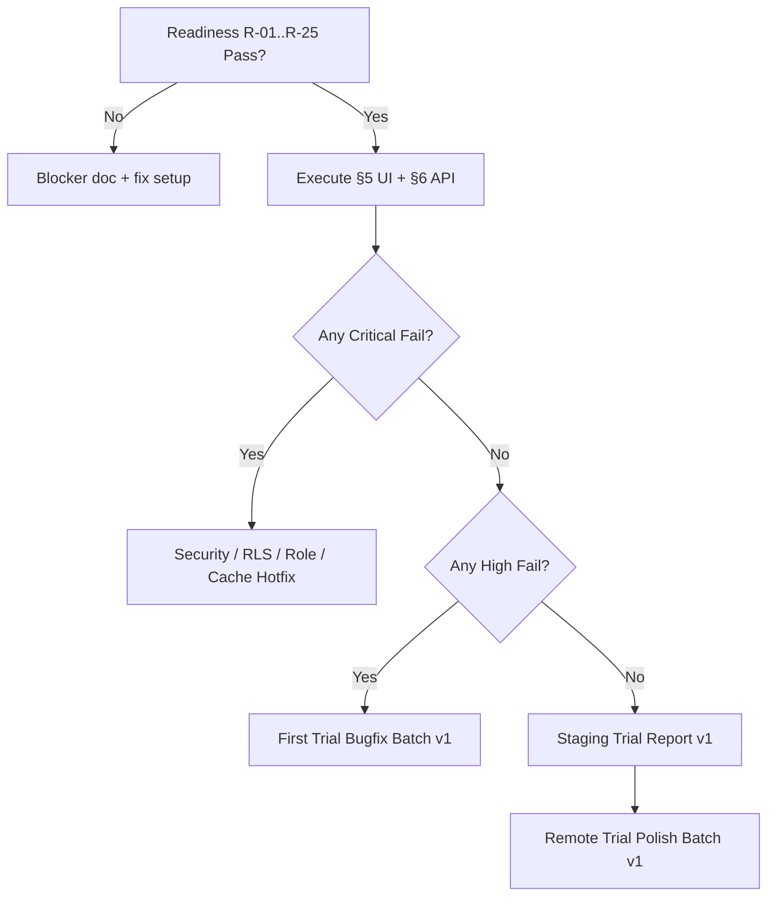

# Staging Live E2E Readiness & Execution v1

> **Paket türü:** Canlı staging/dev E2E hazırlık ve yürütme runbook (dokümantasyon only).  
> **Amaç:** [first_full_app_trial_v1_report.md](first_full_app_trial_v1_report.md) içindeki **Not Tested (live)** maddelerini kapatmak.  
> **Kod değişikliği yok** (critical blocker hariç — bu pakette bugfix yapılmaz).

| İlgili doküman | Kullanım |
|----------------|----------|
| [staging_seed_data_v1.md](staging_seed_data_v1.md) | Seed + Auth bağlama |
| [remote_manual_smoke_test_checklist_v1.md](remote_manual_smoke_test_checklist_v1.md) | UI walkthrough (SMK-*) |
| [supabase_rls_manual_smoke_v1.md](supabase_rls_manual_smoke_v1.md) | Authenticated API/RLS (RLS-*) |
| [first_full_app_trial_v1_report.md](first_full_app_trial_v1_report.md) | Canlı sonuç işleme |

---

## Yürütme durumu (bu paket)

| Alan | Durum |
|------|--------|
| **Cursor/agent canlı staging** | **Erişim yok** — gerçek Supabase URL/key ve Auth parolaları ortamda tutulur. |
| **Bu doküman** | **Execution-ready** — QA manuel olarak çalıştırır. |
| **Sonuç kaydı** | [first_full_app_trial_v1_report.md](first_full_app_trial_v1_report.md) § Live Results Workbook veya **Staging Trial Report v1** (sonraki paket). |

**Genel karar (şimdi):** Ortam hazırlığı tamamlandığında **canlı test yapılabilir**; blocker’lar §2 readiness checklist’tedir.

---

## 1. First Full App Trial — live pending özeti

Aşağıdaki maddeler trial raporunda **Not Tested (live)** idi; bu paket bunları kapatır.

### 1.1 Doctor/Admin

| Trial alanı | Execution ID | Checklist |
|-------------|--------------|-----------|
| Auth login / tenant / logout | LIVE-DOC-01 | §5.1 + SMK-DOC-001…003 |
| Dashboard remote özet | LIVE-DOC-02 | §5.1 + SMK-DOC-010…011 |
| Patients CRUD + arama | LIVE-DOC-03 | §5.1 + SMK-DOC-020…024 |
| Appointments CRUD + iptal | LIVE-DOC-04 | §5.1 + SMK-DOC-030…034 |
| Clinical CRUD + internal note | LIVE-DOC-05 | §5.1 + SMK-DOC-040…045 |
| Patient file / PDF metadata | LIVE-DOC-06 | §5.1 + SMK-DOC-050…053 |
| Timeline | LIVE-DOC-07 | §5.1 + SMK-DOC-060…062 |
| Audit route | LIVE-DOC-08 | §5.1 + SMK-DOC-070 |

### 1.2 Assistant/Secretary

| Trial alanı | Execution ID | Checklist |
|-------------|--------------|-----------|
| Login + operasyonel dashboard | LIVE-AST-01 | §5.2 |
| Patients / appointments | LIVE-AST-02 | §5.2 + SMK-AST-* |
| Diagnosis summary safe view | LIVE-AST-03 | §5.2 + §6 (RLS-S01…S07) |
| Full clinical / audit forbidden | LIVE-AST-04 | §5.2 + SMK-AST-F* |

### 1.3 Physiotherapist

| Trial alanı | Execution ID | Not |
|-------------|--------------|-----|
| Login + FTR dashboard | LIVE-PHY-01 | §5.3 |
| clinical-summaries | LIVE-PHY-02 | §5.3 + RLS-S08…S14 |
| Full clinical forbidden | LIVE-PHY-03 | §5.3 |
| Patient list boş (RLS) | LIVE-PHY-04 | **Beklenen** — ürün notu |
| Files UI yok, RLS scope var | LIVE-PHY-05 | **Partial** — dokümante et |

### 1.4 Nurse

| Trial alanı | Execution ID |
|-------------|--------------|
| Login + dashboard + patients/inventory | LIVE-NUR-01 |
| Forbidden clinical/summary/timeline/audit | LIVE-NUR-02 |

### 1.5 Cross-cutting

| Trial alanı | Execution ID |
|-------------|--------------|
| Cross-tenant / RLS (UI + API) | LIVE-RLS-01 | §6 + SMK-RLS-* + RLS-RLS-* |
| Cache / session switch | LIVE-CCH-01 | §5.5 + SMK-CCH-* |
| Tenant switch / browser refresh | LIVE-CCH-02 |
| Network / error UX | LIVE-UX-01 | SMK-UX-* |
| Mock tam manuel walkthrough | LIVE-MCK-01 | §7 |

---

## 2. Staging environment readiness checklist

Her madde için: ☐ Pass ☐ Fail ☐ N/A — **kanıt** (ekran görüntüsü / SQL satır sayısı / log).

### 2.1 Yapılandırma ve build

| # | Kontrol | Nasıl doğrulanır | Pass kriteri |
|---|---------|------------------|--------------|
| R-01 | `SUPABASE_URL` dart-define dolu | `AppBackendConfig.isSupabaseConfigured` true; login ekranında “backend not configured” yok | URL boş değil |
| R-02 | `SUPABASE_ANON_KEY` dart-define dolu | Aynı | Anon key boş değil |
| R-03 | `DATA_BACKEND=supabase` | `AppBackendConfig.activeBackend == supabase` | Mock’a sessiz düşmüyor |
| R-04 | Supabase initialize | Uygulama açılışında crash yok; `SupabaseClientInitializer` | Client oluşur |
| R-05 | **Commit uyarısı** | URL/key repoda yok | `.git` diff temiz (secret yok) |

### 2.2 Veritabanı ve seed

| # | Kontrol | Nasıl doğrulanır | Pass kriteri |
|---|---------|------------------|--------------|
| R-10 | Migrations uygulandı | Supabase migration history / tablolar var | `clinical_encounters`, RPC’ler mevcut |
| R-11 | Seed uygulandı | `tenants` adı “DrMem Demo Clinic A” | Tenant A satırı |
| R-12 | Demo tenantlar | A active, B active, C suspended (opsiyonel) | `status` doğru |
| R-13 | Seed hastalar | `file_number` LIKE `SEED-A-%` | ≥8 satır Tenant A |

> **Not:** Seed doğrulama için DB admin bakışı kullanılabilir; **RLS smoke** yine authenticated JWT ile yapılır (§6).

### 2.3 Auth ve membership

| # | Kontrol | Nasıl doğrulanır | Pass kriteri |
|---|---------|------------------|--------------|
| R-20 | Demo Auth kullanıcıları oluşturuldu | Dashboard → Authentication → Users | 5+ kullanıcı `@example.test` |
| R-21 | `profiles.auth_user_id` bağlı | `profiles` where email = doctor-a | `auth_user_id` NOT NULL |
| R-22 | Membership active | `memberships.status = active` | doctor/assistant/physio/nurse A |
| R-23 | Login doctor-a | Uygulama email/şifre | Dashboard açılır |
| R-24 | `SessionReadiness` ready | Login sonrası liste yüklenir; blocked ekran yok | `phase == authenticated` |
| R-25 | `ActiveTenantContext` | Tenant adı UI’da (varsa) veya veri Tenant A | Cross-tenant veri yok |
| R-26 | inactive-a@ (opsiyonel) | Login | membership blocked mesajı |
| R-27 | Parola repoda yok | `git grep` password / anon key | Temiz |

### 2.4 Readiness gate

**Canlı E2E’ye başlamak için minimum:** R-01…R-05, R-10…R-13, R-20…R-25 **Pass**.

**Blocker örnekleri:** R-03 Fail (mock mod), R-21 Fail (login membership unavailable), R-11 Fail (boş DB).

---

## 3. Güvenli build/run komutları

> **Uyarı:** `SUPABASE_URL` ve `SUPABASE_ANON_KEY` değerlerini **repoya, bu dokümana veya ekran görüntüsüne commit etmeyin**. Yerel ortam değişkeni, `--dart-define-from-file` (gitignore) veya IDE run configuration kullanın.

### 3.1 Yerel secrets dosyası (önerilen)

`secrets/staging.json` (**.gitignore’a ekleyin**):

```json
{
  "SUPABASE_URL": "<STAGING_PROJECT_URL>",
  "SUPABASE_ANON_KEY": "<STAGING_ANON_KEY>",
  "DATA_BACKEND": "supabase"
}
```

### 3.2 Windows — Supabase (Flutter)

```powershell
cd d:\v2memlabs\membys

# Yöntem A: dart-define-from-file (önerilen)
flutter run -d windows --dart-define-from-file=secrets/staging.json

# Yöntem B: tek tek (placeholder — gerçek değerleri terminalde verin, history’ye dikkat)
flutter run -d windows `
  --dart-define=DATA_BACKEND=supabase `
  --dart-define=SUPABASE_URL=<STAGING_PROJECT_URL> `
  --dart-define=SUPABASE_ANON_KEY=<STAGING_ANON_KEY>
```

### 3.3 Android tablet / cihaz

```powershell
flutter devices
flutter run -d <DEVICE_ID> --dart-define-from-file=secrets/staging.json
```

### 3.4 Mock regression (karşılaştırma)

```powershell
flutter run -d windows --dart-define=DATA_BACKEND=mock
```

### 3.5 Release benzeri smoke (opsiyonel)

```powershell
flutter build windows --dart-define-from-file=secrets/staging.json
```

### 3.6 Supabase local (alternatif staging)

```powershell
cd supabase
supabase start
supabase db reset
# Local URL/key: supabase status çıktısından — yine repoya yazmayın
flutter run -d windows --dart-define-from-file=secrets/local-supabase.json
```

---

## 4. Demo kullanıcı / rol / tenant matrisi

| E-posta (staging) | Flutter rol | DB `memberships.role` | Tenant | Profile ID (seed) |
|-------------------|-------------|------------------------|--------|-------------------|
| `doctor-a@example.test` | doctor | `doctor_admin` | A — DrMem Demo Clinic A | `b0000001-0001-4001-8001-000000000001` |
| `assistant-a@example.test` | assistant | `assistant_secretary` | A | `b0000001-0001-4001-8001-000000000011` |
| `physio-a@example.test` | physiotherapist | `physiotherapist` | A | `b0000001-0001-4001-8001-000000000021` |
| `nurse-a@example.test` | nurse | `nurse` | A | `b0000001-0001-4001-8001-000000000031` |
| `doctor-b@example.test` | doctor | `doctor_admin` | B — DrMem Demo Clinic B | `b0000001-0001-4001-8001-000000000002` |
| `assistant-b@example.test` | assistant | `assistant_secretary` | B | `b0000001-0001-4001-8001-000000000012` |
| `physio-b@example.test` | physiotherapist | `physiotherapist` | B | `b0000001-0001-4001-8001-000000000022` |
| `inactive-a@example.test` | — | `assistant_secretary` (`disabled`) | A | `b0000001-0001-4001-8001-000000000091` |

| Tenant ID | Ad | `status` |
|-----------|-----|----------|
| `a0000001-0001-4001-8001-000000000001` | DrMem Demo Clinic A | `active` |
| `a0000001-0001-4001-8001-000000000002` | DrMem Demo Clinic B | `active` |
| `a0000001-0001-4001-8001-000000000003` | DrMem Suspended Clinic | `suspended` |

**Parola:** Staging password manager / güvenli yerel not — **repoya ve bu dokümana yazılmaz.** Tüm demo kullanıcılar için aynı staging parolası kullanılabilir (yalnız staging).

**Oturum hijyeni:** Her rol testi için **ayrı browser profile / gizli pencere / çıkış** — JWT karışmasın.

---

## 5. Canlı UI walkthrough planı

Her adımda kayıt: **Live Status**, **Evidence**, **Bug ID**, **Severity** (§8).

### 5.1 Doctor/Admin A (sıra ~45–60 dk)

| Step | Aksiyon | Beklenen | Trial / SMK ref |
|------|---------|----------|-----------------|
| 1 | Login `doctor-a@` | `/doctor`, veri yüklenir | LIVE-DOC-01 |
| 2 | Dashboard | Bugün randevu özeti seed ile tutarlı; debug UUID yok | LIVE-DOC-02 |
| 3 | `/patients` | SEED-A-* listesi | LIVE-DOC-03 |
| 4 | SEED-A-001 detay | Açılır | |
| 5 | Yeni hasta (fake) + düzenle | Kayıt OK | |
| 6 | `/appointments` | Liste; bugün/geçmiş/gelecek | LIVE-DOC-04 |
| 7 | Randevu oluştur / düzenle / iptal | Status güncellenir | |
| 8 | `/clinical-records` | Liste | LIVE-DOC-05 |
| 9 | `ce000001-...001` detay | **internalDoctorNote** görünür | |
| 10 | Formda JSON dump / clinical_data ham | **Görünmez** | |
| 11 | Yeni muayene + internal not kaydet | Kolon davranışı | |
| 12 | Hasta dosya metadata | Liste; download yok; signed URL yok | LIVE-DOC-06 |
| 13 | `/pdf-outputs` | Metadata only | |
| 14 | Timeline `p0000001-...001` | Olaylar; audit event yok | LIVE-DOC-07 |
| 15 | `/audit-logs` | Erişilir | LIVE-DOC-08 |
| 16 | Logout → tekrar login | Önceki oturum verisi kalmaz | LIVE-CCH-01 |

### 5.2 Assistant/Secretary A (~30 dk)

| Step | Aksiyon | Beklenen |
|------|---------|----------|
| 1 | Login `assistant-a@` | Operasyonel dashboard |
| 2 | Full clinical kart yok | |
| 3 | Patients list/detail | Temel alanlar |
| 4 | Appointments CRUD/iptal | Operasyonel |
| 5 | `/clinical-records/diagnosis-summary` | RPC verisi; physio referral, control date |
| 6 | URL `/clinical-records/ce000001-...001` | Forbidden / boş |
| 7 | internalDoctorNote taraması | Hiçbir ekranda yok |
| 8 | `/audit-logs`, `/pdf-outputs`, timeline URL | Forbidden |

### 5.3 Physiotherapist A (~25 dk)

| Step | Aksiyon | Beklenen |
|------|---------|----------|
| 1 | Login `physio-a@` | FTR dashboard |
| 2 | `/physiotherapy/clinical-summaries` | bodyRegion, rehab, ROM, FTR goal |
| 3 | Full clinical URL | Forbidden |
| 4 | `/patients` | Boş veya erişim yok (RLS) — not et |
| 5 | `/files` | Route forbidden (UI v1) — **Partial** not |
| 6 | Payment / audit / assistant summary | Forbidden |

### 5.4 Nurse A (~20 dk)

| Step | Aksiyon | Beklenen |
|------|---------|----------|
| 1 | Login `nurse-a@` | Nurse dashboard |
| 2 | `/patients` | Read OK |
| 3 | `/inventory` | Varsa açılır |
| 4 | clinical / summaries / timeline / audit / payment / pdf | Forbidden |

### 5.5 Cache / session (~15 dk)

| Step | Aksiyon | Beklenen |
|------|---------|----------|
| 1 | doctor → logout → assistant | Doctor CE listesi görünmez |
| 2 | assistant → logout → physio | Assistant summary kalmaz |
| 3 | Hard refresh (doctor) | Bootstrap + veri geri gelir |
| 4 | Tenant B doctor-b@ (ayrı oturum) | Yalnız B verisi |

### 5.6 Cross-tenant UI (assistant-a@, JWT tenant A)

| Step | Aksiyon | Beklenen |
|------|---------|----------|
| 1 | Patients’ta SEED-B ara | 0 sonuç |
| 2 | URL `/patients/p0000002-...001` | Fail-safe |
| 3 | diagnosis-summary’de B encounter | Görünmez |

---

## 6. Authenticated RLS/API smoke planı

> **SQL Editor / service_role ile yapılan SELECT RLS pass sayılmaz.**

### 6.1 Oturum alma

1. Uygulamada `doctor-a@` ile login **veya** Supabase Auth sign-in → **user access_token** kopyala (DevTools / session).
2. İstekler: `apikey: <ANON_KEY>` + `Authorization: Bearer <USER_ACCESS_TOKEN>`.

### 6.2 Minimum API matrisi

| Test ID | Kullanıcı | Çağrı | Beklenen |
|---------|-----------|--------|----------|
| API-01 | assistant-a | `rpc/list_assistant_clinical_summaries` | rows > 0 |
| API-02 | assistant-a | `rpc/get_assistant_clinical_summary` ce A | 1 row |
| API-03 | assistant-a | get B encounter | no rows |
| API-04 | assistant-a | `rpc/list_physiotherapist_clinical_summaries` | no rows |
| API-05 | physio-a | `rpc/list_physiotherapist_clinical_summaries` | rows > 0 |
| API-06 | physio-a | get B encounter | no rows |
| API-07 | nurse-a | assistant + physio RPC | no rows |
| API-08 | assistant-a | `GET /clinical_encounters?select=id` | no rows |
| API-09 | nurse-a | `rpc/list_patient_timeline_events` | no rows |
| API-10 | doctor-a | timeline patient A | rows > 0 |
| API-11 | assistant-a | `GET /patient_files` | clinic_operations only |
| API-12 | physio-a | `GET /patient_files` | physiotherapy only |
| API-13 | assistant-a | `GET /patient_files?id=eq.pf...001` (doctor_admin) | no rows |

Detay: [supabase_rls_manual_smoke_v1.md](supabase_rls_manual_smoke_v1.md) — RLS-P*, RLS-N*, RLS-S*, RLS-F*, RLS-T*, RLS-SCH-*.

### 6.3 Forbidden response schema (her API yanıtı)

Yasak key listesi: [supabase_rls_manual_smoke_v1.md](supabase_rls_manual_smoke_v1.md) §12.

Kanıt: `evidence/rls/API-01-assistant-list.json` (gitignore önerilir).

### 6.4 Network inspector (UI alternatifi)

Flutter DevTools → Network → Supabase REST/RPC filtrele → response body key scan.

---

## 7. Mock mode — tam manuel walkthrough (LIVE-MCK-01)

| # | Aksiyon | `DATA_BACKEND=mock` |
|---|---------|---------------------|
| 1 | Rol dropdown — 4 rol | |
| 2 | Doctor: patients, appointments, clinical, timeline, files | |
| 3 | Assistant: diagnosis-summary; full CE URL fail | |
| 4 | Physio: clinical-summaries | |
| 5 | Nurse: patients; clinical forbidden | |

Süre: ~30 dk. Sonuçları trial raporunda **Mock Live Status** sütununa işleyin.

---

## 8. Bug sınıflandırma standardı

| Severity | Örnekler |
|----------|----------|
| **Critical** | Cross-tenant veri; internalDoctorNote leak; full clinical non-doctor; secret/service_role in client; login blocker |
| **High** | Remote CRUD fail; wrong RLS/RPC role; cache stale; save data loss |
| **Medium** | Dashboard count; timeline/file gaps; loading/error weak; nav UX |
| **Low** | Visual; copy; responsive; analyzer info |

**Critical bulunursa:** Bu pakette **düzeltme yok** — raporla → **Security Hotfix Batch v1** / **RLS Projection Hotfix v1**.

---

## 9. Sonuçları trial raporuna işleme

### 9.1 Live Results Workbook (kopyala-yapıştır)

[first_full_app_trial_v1_report.md](first_full_app_trial_v1_report.md) § **Live Results Workbook** tablosunu doldurun.

| Execution ID | Live Status | Evidence | Bug ID | Severity | Next Action |
|--------------|-------------|----------|--------|----------|-------------|
| LIVE-DOC-01 | | | | | |
| LIVE-DOC-02 | | | | | |
| … | | | | | |

**Live Status:** `Pass` | `Fail` | `Partial` | `Not Tested`

### 9.2 Staging Trial Report v1 (sonraki paket)

Tüm workbook tamamlandığında özet metrikler:

- Critical: 0 / N  
- High open: …  
- **Go / No-Go** staging sign-off  

---

## 10. Sonraki aksiyon karar ağacı



| Durum | Sonraki paket |
|-------|----------------|
| **Manual QA henüz çalıştırmadı** | Bu doküman + readiness → sonra execution |
| **Critical yok, High var** | First Trial Bugfix Batch v1 |
| **Critical yok, yalnız Medium/Low** | Staging Trial Report v1 → Remote Trial Polish |
| **Critical var** | Security Hotfix → RLS Hotfix → Role Permission Hotfix |

---

## 11. QA oturum kaydı

| Alan | Değer |
|------|--------|
| Tarih | |
| Tester | |
| Supabase proje (staging adı, **URL yazmayın**) | |
| Build komutu | `dart-define-from-file` / device |
| Readiness Pass sayısı | / 27 |
| UI walkthrough tamamlandı | ☐ |
| API RLS smoke tamamlandı | ☐ |
| Mock walkthrough tamamlandı | ☐ |
| Genel Go/No-Go | |

---

*Execution-ready v1 — canlı sonuçlar QA tarafından girilir.*
