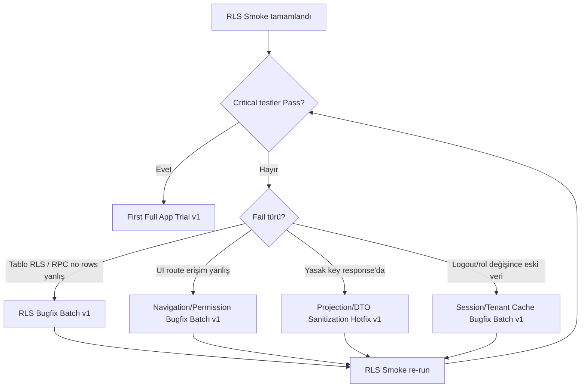

# Supabase RLS Manual Smoke v1

> **Paket türü:** Supabase staging/dev RLS manuel test planı (dokümantasyon only).  
> **Kod / migration / RLS policy değişikliği yok.**

| Alan | Değer |
|------|--------|
| Versiyon | v1 |
| Seed | [staging_seed_data_v1.md](staging_seed_data_v1.md) |
| UI smoke (tamamlayıcı) | [remote_manual_smoke_test_checklist_v1.md](remote_manual_smoke_test_checklist_v1.md) |
| Şema kaynağı | `supabase/migrations/20260522100000_draft_rls_policies_v1.sql`, `20260524100000_safe_clinical_role_summary_projection_v1.sql`, `20260525200000_patient_file_pdf_storage_metadata_v1.sql`, `20260526100000_timeline_db_projection_rpc_v1.sql` |

---

## 1. RLS test amacı ve kapsam

Bu doküman **API/RPC katmanında** (authenticated JWT) Row Level Security ve projection sızıntılarını manuel doğrular. UI route guard ayrı değerlendirilir (§16).

| Kapsam | Ne doğrulanır |
|--------|----------------|
| Auth / session / membership | `auth.uid()`, `profile_id`, `tenant_id` JWT; active vs disabled membership |
| Tenant isolation | Tenant A JWT → Tenant B satırları **yok** |
| `clinical_encounters` RLS | Full SELECT/INSERT/UPDATE yalnız `doctor_admin` |
| Assistant safe summary RPC | `list/get_assistant_clinical_summary` — allowlist kolonlar |
| Physiotherapist safe summary RPC | `list/get_physiotherapist_clinical_summary` — allowlist kolonlar |
| Patient file metadata RLS | `patient_files` + `visibility_scope` (metadata migration v1) |
| PDF metadata RLS | `pdf_outputs` — doctor_admin |
| Timeline RPC | `list_patient_timeline_events` — rol × event subset |
| Patients / appointments | Temel tablo RLS |
| Forbidden response schema | Yasak key’ler response body’de **yok** |
| inactive membership / suspended tenant | Veri kapısı |
| anon / no auth | Erişim kapısı |
| no active tenant | App fail-safe (repository); DB’de `current_tenant_id()` null |

---

## 2. Test ortamı ön koşulları

| # | Ön koşul | Doğrulama |
|---|----------|-----------|
| 1 | Ortam | Staging veya local Supabase (**production değil**) |
| 2 | Seed | Staging Seed Data v1 uygulanmış |
| 3 | Migrations | RLS + safe summary + file metadata + timeline RPC uygulanmış |
| 4 | Tenant A | `a0000001-0001-4001-8001-000000000001` — `active` |
| 5 | Tenant B | `a0000001-0001-4001-8001-000000000002` — `active` |
| 6 | Tenant C (opsiyonel) | `a0000001-0001-4001-8001-000000000003` — `suspended` |
| 7 | Auth kullanıcıları | `doctor-a@`, `assistant-a@`, `physio-a@`, `nurse-a@`, `doctor-b@`, `assistant-b@` … `@example.test` |
| 8 | Profile bağlantısı | `profiles.auth_user_id` set; JWT’de `profile_id` + `tenant_id` (uygulama köprüsü) |
| 9 | Test client | PostgREST / Supabase client + **user access_token** (anon key + session) |
| 10 | Veri | Yalnız seed/demo; gerçek hasta yok |

### Seed referans ID’leri

| Kayıt | UUID |
|-------|------|
| Patient A-001 | `p0000001-0001-4001-8001-000000000001` |
| Patient B-001 | `p0000002-0001-4001-8001-000000000001` |
| CE A + internal note | `ce000001-0001-4001-8001-000000000001` |
| CE B | `ce000002-0001-4001-8001-000000000001` |
| File doctor_admin (A) | `pf000001-0001-4001-8001-000000000001` |
| File clinic_ops (A) | `pf000001-0001-4001-8001-000000000002` |
| File physio (A) | `pf000001-0001-4001-8001-000000000003` |
| Inactive profile | `b0000001-0001-4001-8001-000000000091` |

---

## 3. Test yöntemi uyarıları (zorunlu okuma)

| Uyarı | Açıklama |
|-------|----------|
| **SQL Editor ≠ RLS smoke** | Supabase Dashboard SQL Editor çoğu zaman **service_role / postgres** bağlamında çalışır → RLS **devre dışı** veya farklı davranır. Bu sonuç **RLS pass kabul edilmez**. |
| **Authenticated JWT şart** | Testler `Authorization: Bearer <user_access_token>` ile yapılır (Sign-in sonrası session). |
| **service_role yasak** | `service_role` key repoya/client’a yazılmaz; RLS doğrulama aracı olarak **kullanılmaz**. |
| **UI vs API ayrı** | UI route guard geçse bile API leak olabilir; bu doküman **API/RPC** odaklıdır. |
| **Kanıt** | Network tab, `curl`, Postman, veya `supabase-js` + user session; response JSON kaydedilir. |
| **Şema migration yorumları** | Migration checklist satırları bu dokümanla cross-check edilir. |

### Örnek authenticated çağrı (PostgREST)

```bash
# USER_ACCESS_TOKEN = doctor-a oturumu (service_role DEĞİL)
# SUPABASE_URL ve SUPABASE_ANON_KEY = staging dev

curl -s "${SUPABASE_URL}/rest/v1/patients?select=id,file_number&tenant_id=eq.a0000001-0001-4001-8001-000000000001" \
  -H "apikey: ${SUPABASE_ANON_KEY}" \
  -H "Authorization: Bearer ${USER_ACCESS_TOKEN}" \
  -H "Content-Type: application/json"
```

RPC örneği:

```bash
curl -s "${SUPABASE_URL}/rest/v1/rpc/list_assistant_clinical_summaries" \
  -H "apikey: ${SUPABASE_ANON_KEY}" \
  -H "Authorization: Bearer ${USER_ACCESS_TOKEN}" \
  -H "Content-Type: application/json" \
  -d '{"p_patient_id": "p0000001-0001-4001-8001-000000000001"}'
```

JWT custom claims kullanılıyorsa token’ın `tenant_id` / `profile_id` içerdiğini decode ederek doğrulayın.

---

## 4. Test matrisi (özet)

**Beklenen değerler:** `allowed` | `empty` / `no rows` | `forbidden` (HTTP 401/403 veya PostgREST RLS empty)

| Kaynak | doctor_admin_a | assistant_a | physiotherapist_a | nurse_a | doctor_admin_b (JWT tenant B) | inactive_member | anon |
|--------|----------------|-------------|-------------------|---------|------------------------------|-----------------|------|
| `patients` SELECT | allowed | allowed | **no rows** | allowed | allowed (B only) | no rows | forbidden |
| `appointments` SELECT | allowed | allowed | **no rows** | **no rows** | allowed (B only) | no rows | forbidden |
| `clinical_encounters` SELECT | allowed + `internal_doctor_note` | **no rows** | **no rows** | **no rows** | allowed (B only) | no rows | forbidden |
| `list_assistant_clinical_summaries` | allowed | allowed | **no rows** | **no rows** | allowed (B only) | no rows | forbidden |
| `get_assistant_clinical_summary` (own CE) | allowed | allowed | **no rows** | **no rows** | no rows (cross) | no rows | forbidden |
| `list_physiotherapist_clinical_summaries` | allowed | **no rows** | allowed | **no rows** | allowed (B only) | no rows | forbidden |
| `get_physiotherapist_clinical_summary` (own CE) | allowed | **no rows** | allowed | **no rows** | no rows (cross) | no rows | forbidden |
| `patient_files` SELECT | allowed (all scopes) | clinic_operations only | physiotherapy only | **no rows** | B rows only | no rows | forbidden |
| `pdf_outputs` SELECT | allowed | **no rows** | **no rows** | **no rows** | B only | no rows | forbidden |
| `list_patient_timeline_events` | full subset | operational subset | FTR/rehab subset | **no rows** | no rows (cross patient) | no rows | forbidden |
| `audit_logs` SELECT | allowed | **no rows** | **no rows** | **no rows** | B only | no rows | forbidden |

**Cross-tenant (JWT tenant A, kaynak tenant B):** tüm satırlar → `no rows` / `forbidden`.

**Not:** `doctor_admin` assistant/physio RPC’lerini de çağırabilir (migration uyumluluk); asistan/physio birbirinin RPC’sini çağıramaz.

---

## 5. Positive control testleri

| Test ID | Test | Rol | Endpoint / kaynak | Beklenen | Pass/Fail | Kanıt |
|---------|------|-----|-------------------|----------|-----------|-------|
| RLS-P01 | P1 | doctor_admin_a | `GET /patients?tenant_id=eq.{A}` | ≥1 seed satır (SEED-A-*) | ☐ | |
| RLS-P02 | P2 | doctor_admin_a | `GET /appointments?tenant_id=eq.{A}` | Seed randevuları | ☐ | |
| RLS-P03 | P3 | doctor_admin_a | `GET /clinical_encounters?id=eq.ce000001-...001` | 1 satır; `diagnosis_summary` dolu | ☐ | |
| RLS-P04 | P4 | doctor_admin_a | Aynı CE; kolon `internal_doctor_note` | Non-null fake seed metin | ☐ | |
| RLS-P05 | P5 | assistant_a | `rpc/list_assistant_clinical_summaries` | ≥1 satır; `ce000001-...001` dahil | ☐ | |
| RLS-P06 | P6 | physiotherapist_a | `rpc/list_physiotherapist_clinical_summaries` | ≥1 satır; body_region vb. | ☐ | |
| RLS-P07 | P7 | doctor_admin_a | `rpc/list_patient_timeline_events` `{p_patient_id: p0000001-...001}` | ≥1 event; patient/appointment/clinical/file türleri | ☐ | |
| RLS-P08 | P8 | doctor_admin_a | `GET /patient_files?patient_id=eq.{A patient}` | Tüm visibility_scope seed dosyaları | ☐ | |
| RLS-P09 | P9a | assistant_a | `GET /patient_files` | `pf000001-...002` (clinic_operations) **var**; `...001` doctor_admin **yok** | ☐ | |
| RLS-P10 | P9b | physiotherapist_a | `GET /patient_files` | `pf000001-...003` (physiotherapy) **var**; clinic_ops/doctor_admin **yok** | ☐ | |

---

## 6. clinical_encounters negatif testleri

| Test ID | Test | Rol | Adım | Beklenen | Pass/Fail | Kanıt |
|---------|------|-----|------|----------|-----------|-------|
| RLS-N01 | N1 | assistant_a | `GET /clinical_encounters?select=*` | `[]` veya 0 satır; **internal_doctor_note yok** | ☐ | |
| RLS-N02 | N2 | physiotherapist_a | Aynı SELECT | no rows | ☐ | |
| RLS-N03 | N3 | nurse_a | Aynı SELECT | no rows | ☐ | |
| RLS-N04 | N4 | assistant_a | `GET /clinical_encounters?id=eq.ce000001-...001` | no rows | ☐ | |
| RLS-N05 | N5 | physiotherapist_a | `PATCH /clinical_encounters?id=eq.{any}` | 403 / RLS violation / 0 affected | ☐ | |
| RLS-N06 | N6 | nurse_a | SELECT + INSERT clinical_encounters | forbidden / no rows | ☐ | |
| RLS-N07 | N7 | assistant_a, physio_a, nurse_a | Herhangi CE response body key scan | `internal_doctor_note`, `internalDoctorNote` **yok** | ☐ | |
| RLS-N08 | — | assistant_a | `SELECT * FROM clinical_encounter_operational_summary` (REST view) | security_invoker + CE RLS → **no rows** (doctor-only base table) | ☐ | |

---

## 7. Safe summary RPC RLS testleri

### 7.1 Assistant RPC

| Test ID | Test | Rol | Adım | Beklenen | Pass/Fail | Kanıt |
|---------|------|-----|------|----------|-----------|-------|
| RLS-S01 | S1 | assistant_a | `list_assistant_clinical_summaries` (tenant A) | rows > 0 | ☐ | |
| RLS-S02 | S2 | assistant_a | `get_assistant_clinical_summary(p_encounter_id: ce000001-...001)` | 1 row; allowlist kolonlar | ☐ | |
| RLS-S03 | S3 | assistant_a | `get_assistant_clinical_summary(ce000002-...001)` (Tenant B) | no rows | ☐ | |
| RLS-S04 | S4 | assistant_a | `list_physiotherapist_clinical_summaries` | no rows | ☐ | |
| RLS-S05 | S5 | nurse_a | `list_assistant_clinical_summaries` | no rows | ☐ | |
| RLS-S06 | S6 | assistant_a | Response JSON key scan | `internal_doctor_note`, `clinical_data` **yok** | ☐ | |
| RLS-S07 | S7 | assistant_a | Ham `clinical_data` nested object | **yok** | ☐ | |

### 7.2 Physiotherapist RPC

| Test ID | Test | Rol | Adım | Beklenen | Pass/Fail | Kanıt |
|---------|------|-----|------|----------|-----------|-------|
| RLS-S08 | S8 | physiotherapist_a | `list_physiotherapist_clinical_summaries` | rows > 0 | ☐ | |
| RLS-S09 | S9 | physiotherapist_a | `get_physiotherapist_clinical_summary(ce000001-...001)` | 1 row; `body_region`, `physiotherapy_referral`, vb. | ☐ | |
| RLS-S10 | S10 | physiotherapist_a | get B encounter | no rows | ☐ | |
| RLS-S11 | S11 | physiotherapist_a | `list_assistant_clinical_summaries` | no rows | ☐ | |
| RLS-S12 | S12 | nurse_a | `list_physiotherapist_clinical_summaries` | no rows | ☐ | |
| RLS-S13 | S13 | physiotherapist_a | Response key scan | internal note / clinical_data **yok** | ☐ | |
| RLS-S14 | S14 | physiotherapist_a | Nested leak | **yok** | ☐ | |

### 7.3 Doctor cross-RPC (bilgi)

| Test ID | Not | Beklenen |
|---------|-----|----------|
| RLS-S15 | doctor_admin_a → assistant + physio list RPC | Her ikisi de **allowed** (compat); yine allowlist kolonlar |

---

## 8. PatientFile metadata RLS testleri

| Test ID | Test | Rol | Adım | Beklenen | Pass/Fail | Kanıt |
|---------|------|-----|------|----------|-----------|-------|
| RLS-F01 | F1 | doctor_admin_a | `GET /patient_files?patient_id=eq.p0000001-...001` | `pf...001`, `...002`, `...003` (aktif) | ☐ | |
| RLS-F02 | F2 | assistant_a | Aynı patient filter | Yalnız `visibility_scope=clinic_operations` (`pf...002`) | ☐ | |
| RLS-F03 | F3 | physiotherapist_a | Aynı | Yalnız `physiotherapy` (`pf...003`) | ☐ | |
| RLS-F04 | F4 | nurse_a | `GET /patient_files` | no rows (metadata policy: doctor + assistant only) | ☐ | |
| RLS-F05 | F5 | assistant_a | `GET /patient_files?id=eq.pf000002-...001` (Tenant B) | no rows | ☐ | |
| RLS-F06 | F6 | doctor_admin_a | Soft-deleted seed (varsa) veya `status=deleted` | Listede görünmez | ☐ | |
| RLS-F07 | F7 | multi | Response body | `fileContent`, `pdfContent` **yok** | ☐ | |
| RLS-F08 | F8 | multi | Response body | `signedUrl`, `publicUrl` **yok** | ☐ | |
| RLS-F09 | F9 | multi | `storage_path`, `storage_bucket` | PostgREST ham SELECT doctor’da kolon **dönebilir** (DB metadata). **Signed URL değildir.** Flutter UI’da görünmemeli → UI smoke ayrı. RPC timeline’da path **dönmez**. |
| RLS-F10 | F10 | multi | `metadata` jsonb | `internalDoctorNote`, `clinical_data`, `fileContent` **yok** | ☐ | |

**PDF outputs:**

| Test ID | Rol | Beklenen |
|---------|-----|----------|
| RLS-F11 | doctor_admin_a | `pdf_outputs` own tenant — allowed |
| RLS-F12 | assistant_a / physio_a / nurse_a | no rows |
| RLS-F13 | assistant_a | Tenant B `pdf` id — no rows |

---

## 9. Timeline RPC RLS testleri

| Test ID | Test | Rol | Adım | Beklenen | Pass/Fail | Kanıt |
|---------|------|-----|------|----------|-----------|-------|
| RLS-T01 | T1 | doctor_admin_a | `list_patient_timeline_events(p0000001-...001)` | Çoklu event_type; clinical + file + pdf | ☐ | |
| RLS-T02 | T2 | assistant_a | Aynı patient | Subset: patient.*, appointment.*, `clinical.encounter.*` yalnız `visibility_scope=clinic_operations`, file/pdf clinic_operations | ☐ | |
| RLS-T03 | T3 | physiotherapist_a | Aynı patient | Subset: `clinical.encounter.*` + file/pdf `physiotherapy`; patient/appointment **yok** (migration: physio return false for those) | ☐ | |
| RLS-T04 | T4 | nurse_a | Aynı RPC | no rows (`_timeline_role_allows_event` nurse → false) | ☐ | |
| RLS-T05 | T5 | assistant_a | `p_patient_id = p0000002-...001` (Tenant B) | no rows | ☐ | |
| RLS-T06 | T6 | doctor (suspended tenant C JWT) | Herhangi patient | no rows / scope null | ☐ | |
| RLS-T07 | T7 | multi | Timeline row JSON | `internal_doctor_note` **yok** | ☐ | |
| RLS-T08 | T8 | multi | Timeline metadata | `clinical_data` **yok** | ☐ | |
| RLS-T09 | T9 | multi | Timeline row | `storage_path`, `storage_bucket`, `signedUrl`, `publicUrl` **yok** | ☐ | |
| RLS-T10 | T10 | doctor_admin_a | Event types scan | `permission.denied`, `auth.login`, `safe summary viewed`, `internal note viewed` **yok** | ☐ | |

**UI notu:** Flutter v1 route matrix assistant/physio için `/patient-timeline` guard’ı kapalı olabilir; **RLS-T02/T03** yine de RPC ile doğrulanmalıdır (API leak riski).

---

## 10. Patient / Appointment temel RLS

| Test ID | Test | Rol | Beklenen | Pass/Fail | Kanıt |
|---------|------|-----|----------|-----------|-------|
| RLS-PA01 | PA1 | doctor_admin_a | patients + appointments Tenant A | allowed | ☐ | |
| RLS-PA02 | PA2 | assistant_a | patients + appointments Tenant A | allowed | ☐ | |
| RLS-PA03 | PA3 | physiotherapist_a | `GET /patients` | **no rows** (RLS: physio not in patient role list) | ☐ | |
| RLS-PA04 | PA4 | nurse_a | `GET /patients` | allowed; `GET /appointments` | **no rows** | ☐ | |
| RLS-PA05 | PA5 | assistant_a (JWT A) | `GET /patients?id=eq.p0000002-...001` | no rows | ☐ | |
| RLS-PA06 | PA6 | inactive_member (`b...091`) | patients / assistant RPC / timeline | no rows | ☐ | |
| RLS-PA07 | PA7 | no membership (`b...099`) | patients | no rows | ☐ | |

---

## 11. inactive / no-auth testleri

| Test ID | Test | Koşul | Beklenen | Pass/Fail | Kanıt |
|---------|------|-------|----------|-----------|-------|
| RLS-I01 | I1 | inactive membership | patients list | no rows | ☐ | |
| RLS-I02 | I2 | inactive membership | assistant summary RPC | no rows | ☐ | |
| RLS-I03 | I3 | inactive membership | timeline RPC | no rows | ☐ | |
| RLS-I04 | I4 | suspended tenant C membership (setup gerekir) | any tenant data | no rows / tenant select fails | ☐ | |
| RLS-I05 | I5 | anon (yalnız `apikey`, Bearer yok) | `GET /patients` | 401 / JWT required | ☐ | |
| RLS-I06 | I6 | anon | `rpc/list_assistant_clinical_summaries` | no rows / 401 | ☐ | |
| RLS-I07 | I7 | authenticated, `tenant_id` claim yok + inactive fallback | App repository | `noActiveTenant` / empty — **not** raw SQL error | ☐ | |

---

## 12. Forbidden response schema checklist

Her **assistant / physio summary RPC**, **timeline RPC**, ve **assistant/physio patient_files** response’unda aşağıdaki key’ler **olmamalı** (case-insensitive / snake + camel):

| Yasak key / pattern | Not |
|---------------------|-----|
| `internal_doctor_note` / `internalDoctorNote` | Doctor CE tablosu only |
| `clinical_data` / `clinicalData` / `rawClinicalData` | Ham JSON |
| `fileContent` / `pdfContent` | Binary |
| `signedUrl` / `publicUrl` | URL leak |
| `accessToken` / `serviceRole` / `secret` / `jwt` | Credential |
| `sql` / `stackTrace` / `rawException` | Teknik leak |
| `privateNote` / `doctorPrivateNote` | Private clinical |

**Doctor `clinical_encounters` SELECT:** `internal_doctor_note` **olmalı** (P4); `clinical_data` kolonu doctor policy ile **dönebilir** — assistant/physio/timeline path’lerinde **olmamalı**.

### Schema tarama prosedürü

1. Response JSON’u dosyaya kaydet (`evidence/rls-{testId}.json`).
2. `jq 'paths(scalars) as $p | $p | join(".")' evidence.json` veya manuel arama.
3. Yasak listede eşleşme → **Fail** → Projection/DTO Sanitization Hotfix v1.

| Test ID | Kapsam | Pass/Fail |
|---------|--------|-----------|
| RLS-SCH-01 | Assistant list + get summary | ☐ |
| RLS-SCH-02 | Physio list + get summary | ☐ |
| RLS-SCH-03 | Timeline doctor + assistant + physio | ☐ |
| RLS-SCH-04 | patient_files assistant + physio | ☐ |
| RLS-SCH-05 | Nurse tüm denenen endpoint’ler | ☐ |

---

## 13. Test kayıt formatı

Her test için bir satır (spreadsheet veya markdown tablo):

| Alan | Açıklama |
|------|----------|
| **Test ID** | Örn. `RLS-N01` |
| **Tarih** | ISO-8601 |
| **Ortam** | `staging` / `local` + proje adı |
| **Kullanıcı / rol** | `doctor-a@example.test` / `doctor_admin` |
| **Tenant** | JWT `tenant_id` |
| **Endpoint / RPC** | Tam path veya RPC adı + body |
| **Beklenen sonuç** | allowed / no rows / forbidden |
| **Gerçek sonuç** | HTTP status + row count + not |
| **Pass/Fail** | Pass / Fail |
| **Kanıt** | `evidence/rls-N01.json`, screenshot, HAR |
| **Notlar** | JWT claim, seed id |
| **Bug ID** | Jira/GitHub issue (Fail ise) |

### Oturum özeti şablonu

```markdown
## RLS Smoke Session — YYYY-MM-DD
- Ortam: staging-xxx
- Commit / migration set: ...
- Tester: ...
- Critical Pass: __ / __
- Critical Fail: RLS-___
- Blocker: yes/no
```

---

## 14. Manuel uygulama sırası (önerilen)

1. Positive controls — **RLS-P01…P10**  
2. clinical_encounters negative — **RLS-N01…N08**  
3. Assistant safe summary — **RLS-S01…S07**  
4. Physiotherapist safe summary — **RLS-S08…S14**  
5. PatientFile metadata — **RLS-F01…F13**  
6. Timeline RPC — **RLS-T01…T10**  
7. Patient/Appointment isolation — **RLS-PA01…PA07**  
8. inactive / no-auth — **RLS-I01…I07**  
9. Forbidden schema scan — **RLS-SCH-01…05**  
10. UI confirmation (opsiyonel) — [remote_manual_smoke_test_checklist_v1.md](remote_manual_smoke_test_checklist_v1.md) ilgili maddeler  

**Tahmini süre:** 3–6 saat (hazır Auth + evidence kaydı ile).

---

## 15. Sonraki aksiyon karar ağacı



| Sonuç | Sonraki paket |
|-------|----------------|
| Tüm **critical** Pass | **First Full App Trial v1** |
| `clinical_encounters` / tenant leak | **RLS Bugfix Batch v1** |
| Route guard / menü uyumsuz | **Navigation/Permission Bugfix Batch v1** |
| Yasak key API response | **Projection/DTO Sanitization Hotfix v1** |
| Oturumlar arası veri sızıntısı | **Session/Tenant Cache Bugfix Batch v1** |
| Raporlama | **Staging Trial Report v1** (trial sonrası) |

**Critical test set (minimum):** RLS-P03, P04, P05, P06, P07, N01–N03, S03, S10, F02, F03, F05, T04, T05, T07–T09, PA05, PA06, I05, SCH-01–03.

---

## 16. UI confirmation (tamamlayıcı)

API Pass olsa bile UI smoke çalıştırın:

- Doctor timeline ekranı açılır; nurse timeline RPC no rows ile uyumlu.
- Assistant diagnosis-summary veri gösterir; full CE REST erişimi yok.
- Physio patients REST erişimi yok → UI hasta listesi boş/forbidden olmalı.

Bkz. [remote_manual_smoke_test_checklist_v1.md](remote_manual_smoke_test_checklist_v1.md).

---

## Migration cross-check (staging sign-off)

Staging deploy sonrası migration dosyalarındaki manuel checklist kutularını bu doküman sonuçlarıyla işaretleyin:

- `20260524100000_safe_clinical_role_summary_projection_v1.sql` — assistant/physio RPC matrix  
- `20260525200000_patient_file_pdf_storage_metadata_v1.sql` — visibility_scope  
- `20260526100000_timeline_db_projection_rpc_v1.sql` — role event filter  

---

*Bu doküman yalnızca manuel RLS smoke içindir. Otomatik test veya policy değişikliği gerektirmez.*
